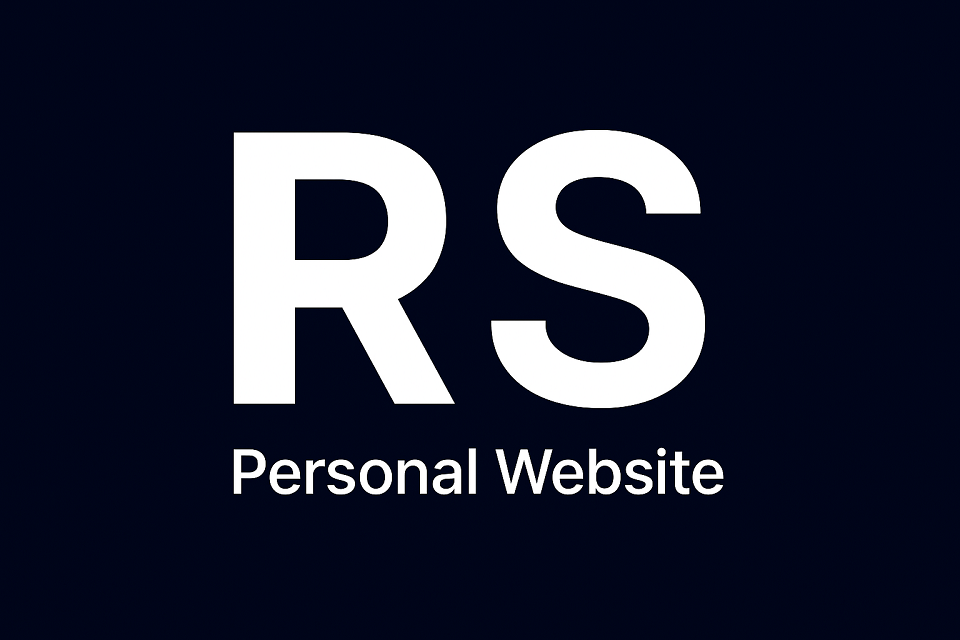

# 💻 Personal Website

A modern, lightning-fast, and elegant personal website built with SvelteKit and the latest web technologies. This project leverages shadcn-svelte for a beautiful, accessible UI and Tailwind CSS for flexible styling.

## ✨ Features
- **SvelteKit**: Maximized performance and SEO-friendliness through Server-Side Rendering (SSR).
- **Tailwind CSS**: Fast and consistent styling with a utility-first CSS approach.
- **shadcn-svelte**: Ready-to-use, customizable, and accessible UI components.
- **Responsive Design**: Optimized for desktop, tablet, and mobile devices.
- **Vite**: A blazing-fast development experience.
- **TypeScript**: Type safety and an improved developer experience.

## 🌐 Live Demo

Check out the live version of this website: [https://ruben-sprengel.de](https://ruben-sprengel.de)

## 🛠️ Technologies

- [Svelte / SvelteKit](https://svelte.dev/)
- [shadcn-svelte](https://www.shadcn-svelte.com/)
- [Tailwind CSS](https://tailwindcss.com/)
- [TypeScript](https://www.typescriptlang.org/)
- [Vite](https://vite.dev/)

## Contributing & Support ❤️

We welcome all forms of support!

- **Contributions:** If you'd like to add new templates, improve existing ones, or report issues, please check out our **[CONTRIBUTING.md](CONTRIBUTING.md)** guide.
- **Support:** Give us a Star here on GitHub. Your feedback and stars help us reach more developers!
- **Sponsoring:** You can also support the project with a small donation via the Ko-fi button.

**Thank you for your support!** 🙏

## Logo Notice / Disclaimer

The logo for this project was generated with an AI tool. No manual or copyrighted works were used as direct templates.